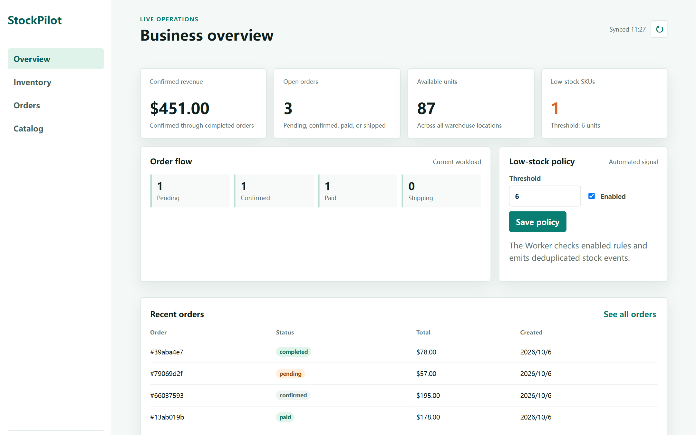

# 多租户库存与订单协同 SaaS

项目已完成模块化单体第一阶段和主要第二阶段能力；测试保留内存 Store，生产 API/Worker 使用 PostgreSQL 持久化。

**这是一个用于面试演示的个人项目**：目标是能把业务闭环真的跑起来、把设计取舍讲清楚，而不是达到生产就绪度。五分钟演示路径见 [docs/demo-runbook.md](docs/demo-runbook.md)。



## 状态

每次提交都会在 CI 上跑三类检查：

| 检查 | 覆盖内容 |
| --- | --- |
| `test` | `gofmt`、`go test ./...`、`go vet`、`go test -race ./...`、`go build` |
| `integration` | 真实 PostgreSQL 16 上执行 `go test -tags=integration ./...`：并发扣减/预占不超卖、幂等键重放与冲突、出入库单原子性与重放、Outbox 并发领取与租约过期 |
| `compose` | `docker compose up --build` 后执行 `scripts/smoke.sh` 的业务端到端冒烟 |

上图与 [docs/admin-orders.png](docs/admin-orders.png) 是真实运行的管理台（登录后由无头浏览器截取，数据来自实际 API 调用）。

**v1 的范围（Definition of Done）**

- 包含：多租户与权限、商品/SKU/仓库、库存预占与扣减、订单状态机、报表、CSV 导入导出、Outbox + Worker、Webhook 签名投递、库存预警、审计日志、内嵌管理台
- 明确不做（留到 v1 之后）：多实例限流的全局配额、Kubernetes 部署、计费、SSO、管理台的浏览器端自动化测试
- 完成标准：三类 CI 检查全绿、`scripts/smoke.sh` 端到端通过、未覆盖的部分如实列在下面

**有意简化 / 未覆盖**（面试演示项目，按需取舍）

- 单元测试全部针对内存 Store；SQL 层由上表的集成测试覆盖，不做压测与长稳测试
- 管理台没有浏览器端自动化测试，接口层由 `scripts/smoke.sh`（Linux/CI）与 `scripts/smoke.ps1`（Windows 本机）覆盖
- 限流是单进程内存实现；多实例全局配额、Kubernetes、计费、SSO 都不在范围内

**不用 Docker 的本地路径**（本机 Docker/WSL 不可用时）

先准备一份解压好的 PostgreSQL Windows 二进制包（例如 [EDB binaries](https://www.enterprisedb.com/download-postgresql-binaries)），然后一条命令拉起本机栈：

```powershell
# 便携 PostgreSQL + 迁移 + API（Ctrl+C 停 API；-Action down 停数据库）
powershell -File scripts\dev.ps1 -PgRoot <解压目录>\pgsql -DataDir <数据目录>
# 只准备数据库、不启动 API
powershell -File scripts\dev.ps1 -PgRoot <解压目录>\pgsql -DataDir <数据目录> -Action check
# 端到端业务冒烟（PowerShell 版：不需要 bash/jq，Mailpit 不可达时只跳过邮件断言）
powershell -File scripts\smoke.ps1
```

手工等价步骤如下：

```bash
# 1. 建库，并按文件名顺序执行 migrations/*.up.sql（000001 … 000012）
psql -U postgres -d saas -f migrations/000001_initial_schema.up.sql

# 2. 启动 API（AUTH_TOKEN_SECRET 至少 32 字符）
DATABASE_URL='postgres://postgres@localhost:5432/saas?sslmode=disable' \
  AUTH_TOKEN_SECRET='<32 字符以上随机串>' go run ./cmd/api

# 3. 浏览器打开 http://localhost:8080/
#    若 127.0.0.1:8080 已被其他程序占用（例如 Steam），请改用 localhost 或调整 HTTP_ADDR

# 4. 集成测试（用一个没有其他待处理 Outbox 事件的专用库；CI 每次都会新建）
TEST_DATABASE_URL='postgres://postgres@localhost:5432/saas_test?sslmode=disable' \
  go test -tags=integration ./...
```

**Docker 起不来时先查 WSL**：如果 `wsl -l -v` 超过几秒不返回，Docker Desktop 的日志会出现 `DockerDesktop/Wsl/CommandTimedOut` 且 Linux 引擎无法启动。用管理员 PowerShell 执行 `Restart-Service WSLService -Force`（或重启机器），确认 `wsl -l -v` 秒回后再启动 Docker Desktop。

## 模块结构

项目采用模块化单体结构，各模块职责与 API 详见各自目录下的 README：

- [`cmd/api`](cmd/api/README.md) — HTTP API 服务入口，路由分发、中间件链与优雅退出
- [`cmd/worker`](cmd/worker/README.md) — 后台 Worker，领取 Outbox 事件、投递通知/Webhook 并执行库存预警扫描
- [`internal/auth`](internal/auth/README.md) — 多租户、用户、角色、权限、会话令牌与密码重置
- [`internal/product`](internal/product/README.md) — 商品、SKU 与仓库目录
- [`internal/inventory`](internal/inventory/README.md) — 库存变动与入库/出库单
- [`internal/order`](internal/order/README.md) — 销售订单与状态机
- [`internal/report`](internal/report/README.md) — 经营报表
- [`internal/outbox`](internal/outbox/README.md) — 事务性事件队列（Outbox 模式）
- [`internal/notification`](internal/notification/README.md) — 通知分发与 SMTP 邮件
- [`internal/webhook`](internal/webhook/README.md) — Webhook 订阅与签名投递
- [`internal/alert`](internal/alert/README.md) — 库存预警规则与扫描
- [`internal/audit`](internal/audit/README.md) — 审计日志
- [`internal/export`](internal/export/README.md) — CSV 导出
- [`internal/importer`](internal/importer/README.md) — 库存 CSV 导入
- [`internal/httpx`](internal/httpx/README.md) — HTTP 中间件、健康检查、指标与安全
- [`internal/config`](internal/config/README.md) — 环境配置
- [`internal/adminui`](internal/adminui/README.md) — 内嵌管理台
- [`internal/worker`](internal/worker/README.md) — Worker 指标
- [`internal/platform`](internal/platform/README.md) — 平台基础包（ID、分页、PostgreSQL、事务）
- [`migrations`](migrations/README.md) — PostgreSQL 迁移
- [`scripts`](scripts/README.md) — 冒烟测试脚本
- [`docs`](docs/README.md) — 架构与演示文档

## 运行

```bash
go run ./cmd/api
```

## API（第一阶段）

- `POST /organizations` 创建组织和首位所有者：`{"name":"Acme","owner_email":"owner@example.com","owner_name":"Owner","owner_password":"password123"}`
- `GET /organizations/{id}` 查询组织资料
- `PUT /organizations/{id}` 更新组织名称
- `POST /organizations/{id}/roles` 创建角色
- `GET /organizations/{id}/roles` 查询角色
- `POST /organizations/{id}/users` 创建用户（角色必须属于同一组织）
- `GET /organizations/{id}/users` 查询用户

组织 ID 由服务端生成，创建组织时会在同一数据库事务内建立拥有全部权限的 `owner` 角色和首位用户。所有用户和角色操作都显式绑定组织 ID，避免跨租户关联。

## 库存 API

商品、SKU 和仓库支持创建、查询及业务维护：

- `PUT /organizations/{id}/products/{productId}` 更新商品名称和描述
- `PUT /organizations/{id}/products/{productId}/skus/{skuId}` 更新 SKU 编码、名称和售价
- `PUT /organizations/{id}/warehouses/{warehouseId}` 更新仓库名称和地址

- `GET /organizations/{id}/stocks` 查询组织库存
- `GET /organizations/{id}/warehouses/{warehouseId}/skus/{skuId}/stock` 查询单个库存
- `POST .../stock/receive` 入库，参数：`{"quantity":10,"idempotency_key":"receipt-1"}`
- `POST .../stock/reserve` 预占库存
- `POST .../stock/release` 释放预占
- `POST .../stock/deduct` 扣减库存

库存变更在服务层使用互斥锁保证并发安全；普通 `deduct` 只扣减可用库存，订单确认使用内部的预占消费操作扣减已预占库存。相同组织下重复使用同一幂等键不会重复变更库存，参数不一致会返回冲突。

## 销售订单 API

- `POST /organizations/{id}/orders` 创建订单并批量预占库存
- `GET /organizations/{id}/orders` 查询订单
- `POST /organizations/{id}/orders/{orderId}/confirm` 确认订单并扣减已预占库存
- `POST /organizations/{id}/orders/{orderId}/pay` 标记已支付
- `POST /organizations/{id}/orders/{orderId}/ship` 标记已发货
- `POST /organizations/{id}/orders/{orderId}/complete` 标记已完成
- `POST /organizations/{id}/orders/{orderId}/refund` 退款并回补已扣减库存
- `POST /organizations/{id}/orders/{orderId}/cancel` 取消订单并释放预占库存

订单创建失败时会补偿释放此前已经成功预占的明细；相同订单幂等键重复提交会返回原订单。状态严格按 `pending -> confirmed -> paid -> shipped -> completed` 流转；`pending` 可取消，`paid/shipped/completed` 可退款，退款在同一事务中回补库存，重复退款请求不会重复入库。
订单价格以组织内 SKU 当前售价为准，服务端不会信任客户端提交的单价，避免通过接口篡改销售金额。

## 经营报表 API

- `GET /organizations/{id}/reports/summary`
- 可选参数 `low_stock_threshold`，统计可用库存小于等于该阈值的库存项

报表返回订单状态数量、已确认销售额，以及库存总量、预占量、可用量和低库存数量，并始终按组织隔离。

## 入库单 / 出库单 API

- `POST/GET /organizations/{id}/receipts` 创建或查询入库单
- `GET /organizations/{id}/receipts/{documentId}` 查询入库单详情
- `POST/GET /organizations/{id}/issues` 创建或查询出库单
- `GET /organizations/{id}/issues/{documentId}` 查询出库单详情

单据使用 `idempotency_key` 防止重复记账；多明细处理中途失败时会补偿已完成的库存变更。

## 异步通知

`internal/notification` 基于 Outbox 执行器发送订单等业务事件。`DispatchOnce` 会批量领取事件，发送成功后标记 `published`，发送失败则进入退避重试；发送器由业务侧注入，可接邮件、短信、Webhook 或消息队列。

## 权限中间件与 API 文档

除组织创建、登录、密码重置、健康检查和管理台静态资源外，业务 API 均要求 Bearer Token。运行时按 `user:read/write`、`role:read/manage`、`product:read/write`、`inventory:read/write/import`、`order:read/write/approve`、`report:read/export`、`audit:read` 和 `webhook:manage` 权限保护对应路由，并拒绝令牌租户与 URL 租户不一致的请求。

完整接口草案见 [docs/openapi.yaml](docs/openapi.yaml)。

## 本地开发

完整容器栈（API、Worker、PostgreSQL、迁移和 Mailpit）：

```bash
docker compose up --build
```

启动后访问 `http://localhost:8080/` 可使用内嵌管理台完成登录、库存、订单和目录操作。完整的面试演示流程见 [docs/demo-runbook.md](docs/demo-runbook.md)。

代码验证：

```bash
go test ./...
go vet ./...
go build ./...
bash scripts/smoke.sh
```

API 容器监听 `8080`，PostgreSQL 通过健康检查且数据库迁移成功后才会启动 API。
API 容器自身也通过 `/healthz` 健康检查，便于 Compose 或编排平台摘除未就绪实例。

服务存活检查：`GET /healthz`；包含 PostgreSQL 连通性的就绪检查：`GET /readyz`。通过 `.env.example` 中的环境变量可配置监听地址和 PostgreSQL 连接串；服务收到 SIGINT/SIGTERM 时会等待正在处理的请求完成后退出。

## 常用命令

```bash
make test       # 单元测试
make build      # 构建全部 Go 包
make docker-up  # 启动 PostgreSQL
```

GitHub Actions 会在每次提交和 Pull Request 上使用官方 Go 工具链执行格式检查、测试、`go vet`、竞态测试和构建。

## Webhook

`internal/webhook` 提供带 HMAC-SHA256 签名的 HTTP 推送：请求包含 `X-Webhook-Event`、`X-Webhook-Id`、`X-Idempotency-Key` 和 `X-Webhook-Signature`，默认超时 10 秒，非 2xx 响应会返回错误交给 Outbox 重试。

Webhook 订阅通过 `POST/GET /organizations/{id}/webhooks` 和 `DELETE /organizations/{id}/webhooks/{webhookId}` 管理，要求 `webhook:manage` 权限。创建时需提供 URL、至少 16 字符的签名密钥和事件类型列表（`*` 表示全部）。`cmd/worker` 持续领取 Outbox 事件并向匹配订阅投递，Compose 默认同时启动该 Worker；可通过 `OUTBOX_POLL_INTERVAL_MS` 和 `OUTBOX_BATCH_SIZE` 调整吞吐。

## 库存预警

`internal/alert` 扫描组织库存，将低于阈值的库存写入 Outbox 事件 `stock.low`；事件按库存更新时间和可用量去重，重复扫描不会重复产生告警。

租户通过 `GET/PUT /organizations/{id}/alerts/stock` 查询或设置预警阈值与启用状态。Worker 默认每 60 秒扫描所有启用规则，可使用 `STOCK_ALERT_INTERVAL_SECONDS` 调整频率。

## CSV 导出

`internal/export` 提供订单和库存 CSV 导出函数，可接入后台任务或 HTTP 下载接口，输出包含组织、状态、金额和库存数量等关键字段。

`internal/importer` 提供同格式库存 CSV 导入，校验组织归属、重复库存项、非负数量及 `available = on_hand - reserved` 派生关系。校验完成后在单个 PostgreSQL 事务中批量写入，任一仓库/SKU 外键或数据非法时整批回滚。

CSV 下载接口：

- `GET /organizations/{id}/exports/orders/csv`
- `GET /organizations/{id}/exports/stocks/csv`

库存导入接口：`POST /organizations/{id}/imports/stocks`，请求体为库存 CSV，服务会先完成整批校验和原子落库，再返回导入结果。

## 会话令牌

`internal/auth` 提供 HMAC-SHA256 无状态令牌的签发与验证，令牌包含用户、组织和过期时间声明；验证时会检查签名和过期时间，适合接入网关或权限中间件。

`RequireTokenPermission` 支持标准 `Authorization: Bearer <token>` 请求头，并将验证后的 Claims 注入 request context。

`POST /organizations/{id}/sessions` 使用邮箱和密码登录并签发 15 分钟访问令牌和 30 天刷新令牌；`PUT` 可使用刷新令牌换取新的访问令牌，`DELETE` 撤销当前会话。用户可被禁用，禁用后无法登录且已有会话立即失效。密码仅以 bcrypt 哈希形式存储。

登录连续失败 5 次后按账号锁定 15 分钟，成功登录会清除失败计数。密钥轮换期间可在 `AUTH_TOKEN_PREVIOUS_SECRETS` 中以逗号分隔配置旧密钥；新令牌始终使用 `AUTH_TOKEN_SECRET` 签发。

密码重置接口为 `POST/PUT /organizations/{id}/sessions/password-reset`。请求接口对存在和不存在的邮箱都返回 `202`，防止账号枚举；有效请求会创建 15 分钟有效、只能消费一次的 SHA-256 令牌，并通过 Outbox 事件 `auth.password_reset_requested` 异步交给通知/Webhook 投递。确认重置时会校验组织边界、更新 bcrypt 密码并撤销该用户的所有既有会话。

OpenAPI 文档已包含 Bearer Token 安全方案，以及报表、库存和 CSV 导出接口定义。

架构细节见 [docs/architecture.md](docs/architecture.md)，安全问题报告流程见 [SECURITY.md](SECURITY.md)。

数据库事务辅助代码见 [internal/platform/sqltx](internal/platform/sqltx)，可在 PostgreSQL Repository 中复用事务提交、回滚和库存行锁逻辑。
组织、用户、角色和权限模块运行时已使用 PostgreSQL Store，用户与角色关联在同一事务中写入。
商品、SKU 和仓库模块运行时也使用 PostgreSQL Store，组织内编码与名称唯一性由数据库约束保证。
库存变更运行时使用 PostgreSQL 事务、`FOR UPDATE` 行锁和数据库级幂等操作表，可在多 API 实例下防止超卖与重复扣减。
销售订单与明细运行时使用 PostgreSQL Store，并在同一事务中创建；组织范围幂等键由数据库唯一约束保证。
Outbox 运行时使用 PostgreSQL `FOR UPDATE SKIP LOCKED` 领取事件，支持多消费者并行处理和租约超时恢复。

项目采用 MIT License，贡献规范见 [CONTRIBUTING.md](CONTRIBUTING.md)。

## Outbox 与审计基础

`internal/outbox` 提供事件入队、幂等去重、批量领取、成功确认和失败重试。事件达到最大尝试次数后进入终态 `failed`，不会再次被领取；非终态失败使用递增退避时间。事件领取带有五分钟租约，消费者崩溃后租约过期，事件可被其他消费者重新领取。

`internal/audit` 使用 PostgreSQL 持久化组织级审计记录。所有已认证的写请求会自动记录操作者、动作、资源路径、响应状态和 Request ID；拥有 `audit:read` 权限的用户可通过 `GET /organizations/{id}/audit-logs` 查询最近 500 条记录。

## PostgreSQL 迁移

`migrations/000001_initial_schema.up.sql` 定义第一版持久化结构，覆盖租户、权限、商品、仓库、库存、订单、Outbox 和审计日志。库存表通过 `CHECK (reserved <= on_hand)` 保证预占量不会超过现有库存；订单和 Outbox 使用组织范围内的幂等唯一约束。
`000002_inventory_documents` 增加入库单、出库单及其明细表，使用组织范围幂等约束和组合外键。

迁移文件兼容 golang-migrate、goose 等常见工具。

API Server 默认添加 `X-Request-ID`、访问日志和 panic 恢复中间件，便于请求追踪并避免单个异常导致进程退出。
客户端提供的 Request ID 会限制长度并拒绝控制字符，避免日志注入。

`GET /metrics` 暴露 Prometheus 兼容的请求总数、错误数和响应字节数指标。

API 默认启用安全响应头、2 MiB 请求体限制和按直接连接地址的基础限流（每分钟 120 次）。服务不信任客户端自带的 `X-Forwarded-For`，生产环境应在可信网关层继续配置更细粒度的租户和用户限流。
限流器会清理过期客户端桶并限制缓存规模，避免长期运行时出现无界内存增长。
