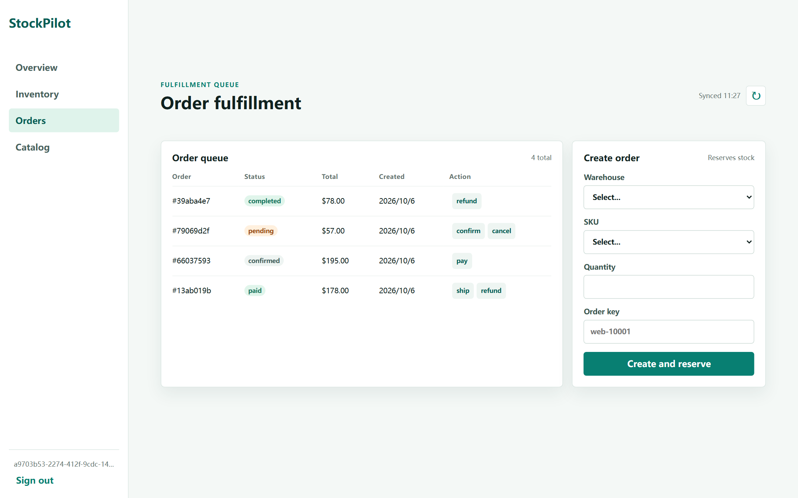

# 多租户库存与订单协同 SaaS

一个用 Go 写的多租户库存/订单后端：租户与权限、商品与库存、入库出库单、订单状态机、经营报表、CSV 导入导出、事务性 Outbox + Worker、HMAC 签名 Webhook、库存预警、审计日志，外加一个内嵌的管理台。技术栈是 Go 1.22 + PostgreSQL 16 + 原生 JS（管理台无构建步骤），不依赖任何 Web 框架。

这是一个**个人项目 / 面试演示**：功能闭环、并发与幂等这类"讲得清的点"都做了真实现和测试，但刻意不做生产级的那部分（K8s、计费、SSO、压测）——见下面的[范围](#状态与范围)。


## 状态与范围

每次提交都会在 CI 上跑三类检查，当前全绿：

| 检查 | 覆盖内容 |
| --- | --- |
| `test` | `gofmt`、`go test ./...`、`go vet`、`go test -race ./...`、`go build` |
| `integration` | 真实 PostgreSQL 16 上跑 `go test -tags=integration ./...`：并发扣减/预占不超卖、幂等键重放与冲突、出入库单原子性与重放、Outbox 并发领取与租约过期 |
| `compose` | `docker compose up --build` 后跑 `scripts/smoke.sh` 的业务端到端冒烟（19 项） |



- 做完的：多租户与权限、商品/SKU/仓库、库存预占与扣减、订单状态机、报表、CSV 导入导出、Outbox + Worker、Webhook 签名投递、库存预警、审计日志、内嵌管理台
- 明确不做的：Kubernetes、计费、SSO、多实例限流的全局配额、管理台的浏览器端自动化测试、压测与长稳测试
- 有意简化：单元测试针对内存 Store（SQL 层靠上面的集成测试覆盖）；限流是单进程内存实现

## 快速开始

完整容器栈（API、Worker、PostgreSQL、迁移、Mailpit）：

```bash
docker compose up --build
```

启动后打开 <http://localhost:8080/> 用管理台登录、看库存、下订单；邮件通知落在 Mailpit 的 <http://localhost:8025/>。若 `5432` 已被占用或被 Windows 保留段圈走，用 `$env:POSTGRES_PORT='15433'; docker compose up -d --wait`。

不用 Docker 的本地路径（Docker/WSL 挂掉时的备胎，需要一份解压好的 PostgreSQL Windows 二进制包）：

```powershell
# 便携 PostgreSQL + 迁移 + API（Ctrl+C 停 API，-Action down 停数据库）
powershell -File scripts\dev.ps1 -PgRoot <解压目录>\pgsql -DataDir <数据目录>
# 端到端冒烟（PowerShell 版，不需要 bash/jq；Mailpit 不可达时只跳过邮件断言）
powershell -File scripts\smoke.ps1
```

代码验证：

```bash
go test ./...                                     # 单元测试（内存 Store）
go vet ./... && go build ./...
TEST_DATABASE_URL='postgres://postgres@localhost:5432/saas_test?sslmode=disable' \
  go test -tags=integration ./...                 # 真实 PostgreSQL（CI 上每次新建库）
bash scripts/smoke.sh                             # Linux/CI；Windows 用 scripts\smoke.ps1
```

存活检查 `GET /healthz`、含数据库连通性的就绪检查 `GET /readyz`；配置项见 [.env.example](.env.example)。

## 值得一看的设计

- **并发与幂等**：库存变更走 PostgreSQL 事务 + `FOR UPDATE` 行锁 + 数据库级幂等操作表，`CHECK (reserved <= on_hand)` 兜底，多 API 实例也不会超卖或重复扣减；重复幂等键返回原结果，参数不一致返回冲突。
- **订单状态机**：`pending → confirmed → paid → shipped → completed`，取消释放预占、退款回补库存且重复退款不重复入库；价格以服务端 SKU 当前售价为准，不信任客户端单价。
- **Outbox**：事件入队、幂等去重、`FOR UPDATE SKIP LOCKED` 批量领取、五分钟租约（消费者崩溃后可被重新领取）、递增退避重试、超过上限进终态 `failed`。
- **认证与租户隔离**：HMAC-SHA256 无状态令牌（15 分钟访问 + 30 天刷新）、bcrypt 存储、登录失败锁定、密码重置对存在与否的邮箱都返回 202；令牌租户与 URL 租户不一致直接拒绝。
- **两套 Store**：内存实现供单元测试、PostgreSQL 实现供运行，同一套接口，业务层不感知。
- **内嵌管理台**：原生 JS 直接嵌进二进制，同源 CSP（无 inline），登录后能看总览、库存、订单队列、目录四个视图。
- **可观测性与安全**：`X-Request-ID`、访问日志、panic 恢复、Prometheus `/metrics`、安全响应头、2 MiB 体积限制、按连接地址的基础限流。

## 模块与文档

模块化单体，每个模块都有自己的 README：

- [`cmd/api`](cmd/api/README.md) · [`cmd/worker`](cmd/worker/README.md) — 服务入口与后台 Worker
- [`internal/auth`](internal/auth/README.md) · [`internal/product`](internal/product/README.md) · [`internal/inventory`](internal/inventory/README.md) · [`internal/order`](internal/order/README.md) · [`internal/report`](internal/report/README.md) — 业务域
- [`internal/outbox`](internal/outbox/README.md) · [`internal/notification`](internal/notification/README.md) · [`internal/webhook`](internal/webhook/README.md) · [`internal/alert`](internal/alert/README.md) · [`internal/audit`](internal/audit/README.md) · [`internal/worker`](internal/worker/README.md) — 异步与运维
- [`internal/export`](internal/export/README.md) · [`internal/importer`](internal/importer/README.md) · [`internal/adminui`](internal/adminui/README.md) · [`internal/httpx`](internal/httpx/README.md) · [`internal/config`](internal/config/README.md) · [`internal/platform`](internal/platform/README.md) — 支撑
- [`migrations`](migrations/README.md) · [`scripts`](scripts/README.md) · [`docs`](docs/README.md) — 迁移、脚本与文档索引

- 接口草案（含 Bearer 方案）：[docs/openapi.yaml](docs/openapi.yaml)
- 架构与取舍：[docs/architecture.md](docs/architecture.md)
- 五分钟面试演示流程：[docs/demo-runbook.md](docs/demo-runbook.md)

## 排查

- **Docker 起不来先查 WSL**：`wsl -l -v` 超过几秒不返回时，Docker Desktop 日志会出现 `DockerDesktop/Wsl/CommandTimedOut`。用管理员 PowerShell `Restart-Service WSLService -Force`（或重启机器），确认 `wsl -l -v` 秒回后再启动 Docker Desktop。
- **端口被 Windows 保留**：`netsh int ipv4 show excludedportrange protocol=tcp` 把 5432 圈进 Hyper-V 保留段时，`docker compose up` 报 `bind: ... forbidden by its access permissions`，换主机端口即可（`POSTGRES_PORT`，容器内互连不受影响）。
- **停/起 Docker 引擎后容器 DNS 失效**：日志出现 `lookup postgres on 127.0.0.11:53: no such host` 且服务反复重启时，旧容器还挂在重启前的网络命名空间上，`docker compose down --remove-orphans; docker compose up -d --wait` 重建即可。
- **拉镜像抽风**：Docker Desktop 4.90 不会把 `~/.docker/daemon.json` 的 `registry-mirrors` 交给 Linux 引擎（docker.io 走它内置的 hubproxy），要在 **Settings → Resources → Proxies** 配代理才生效；只想用镜像站就显式拉，例如 `docker pull docker.m.daocloud.io/library/alpine:3.21`。
- **`127.0.0.1:8080` 被别的程序占用**（例如 Steam）时改用 `localhost` 或调整 `HTTP_ADDR`。

MIT License，安全问题报告流程见 [SECURITY.md](SECURITY.md)，贡献规范见 [CONTRIBUTING.md](CONTRIBUTING.md)。
