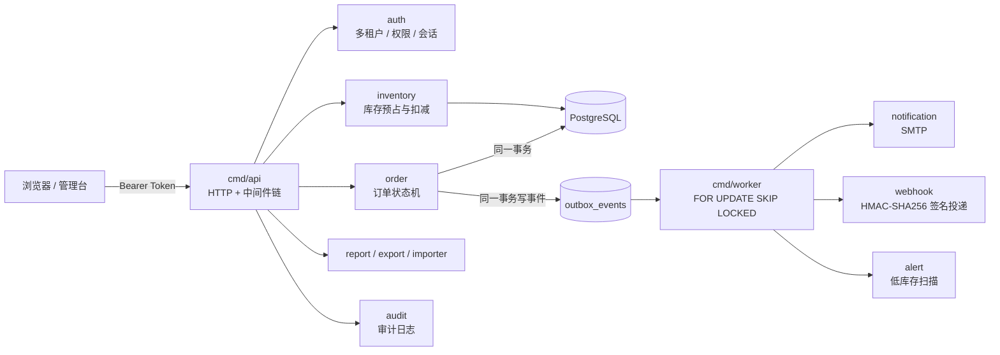

# 架构与一致性说明

项目采用模块化单体结构，各领域通过 Store/Provider 接口隔离；单元测试使用内存实现，真实运行路径使用 PostgreSQL 持久化，并由独立 Worker 处理 Outbox 与 Webhook。

## 两套 Store 的取舍

- **内存 Store**：单元测试零依赖、跑得快，覆盖租户隔离、幂等、并发、回滚等逻辑。
- **PostgreSQL Store**：真实运行路径，正确性写在 SQL 里（行锁、`CHECK` 约束、唯一约束、`SKIP LOCKED`）。
- 代价是 SQL 层不会被普通单元测试覆盖，因此有 `-tags=integration` 的集成测试专门跑真实数据库（见 CI 的 `integration` job）。这是本仓库里最值得讲的一个设计取舍。

## 关键一致性边界

1. 库存操作在单个服务临界区内串行化；PostgreSQL 版本使用 `SELECT ... FOR UPDATE`。
   `internal/platform/sqltx` 提供标准 `database/sql` 事务封装和库存行锁查询。
2. PostgreSQL 订单创建、确认、取消以及入库/出库单在同一事务内完成库存行锁定、库存更新、业务记录和 Outbox 写入；内存实现保留补偿路径用于单元测试。
3. 订单确认消费已预占库存，普通出库只允许扣减可用库存，所有库存相关行按仓库和 SKU 稳定排序加锁。
4. 订单、库存和 Outbox 事件使用幂等键，重复请求不会重复记账；同键不同参数返回冲突。
5. Outbox 消费失败使用递增退避，达到最大次数后进入 `failed` 终态；事件领取带五分钟租约，消费者崩溃后租约过期可被其他消费者重新领取。
6. 所有业务资源携带 `organization_id`，查询与组合外键均按租户隔离；Token 租户与 URL 租户不一致的请求会被拒绝。

## 请求链路上的横切关注点

- 请求 ID、访问日志、panic 恢复、安全响应头（含 CSP：只允许同源脚本/样式）、2 MiB 请求体上限、按连接的基础限流。
- 所有已认证的写请求自动写审计记录（操作者、动作、资源路径、状态码、请求 ID）。

## 如果上线，还需要什么

- API 实例无状态运行在负载均衡后；PostgreSQL 使用托管高可用版本并配置备份。
- Outbox 消费者独立扩容，Webhook 发送器设置超时与重试；限流需要换成共享存储以支持多实例。
- 日志、指标和审计记录写入集中式平台；迁移作为独立发布步骤执行。
